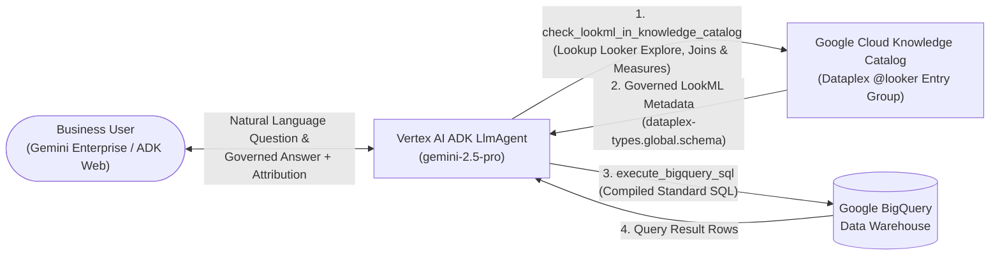

# Architecture, Design & Deployment Guide: Looker Knowledge Catalog + BigQuery Analyst Agent

This guide provides the end-to-end technical architecture, design patterns, code snippets, and deployment instructions for building a **Governed Data Analyst Agent** using the **Google Agent Development Kit (`google-adk`)**, **Google Cloud Knowledge Catalog (Dataplex)**, and **Google BigQuery**, deployed to **Cloud Run**, **Vertex AI Agent Engine**, and **Gemini Enterprise (Google Agentspace)**.

---

## 1. Executive Overview & Architecture

Traditional Text-to-SQL agents often hallucinate metric formulas, join conditions, and fiscal calendar rules when querying raw data warehouse tables directly.

To guarantee **100% metric governance**, this agent enforces a two-tier semantic architecture:
1. **Semantic Discovery Layer (Dataplex Knowledge Catalog MCP)**:
   - The agent queries Google Cloud Knowledge Catalog (Dataplex) to discover **Looker Explores** (`dataplex-types.global.looker-explore`) and **Looker Views** (`dataplex-types.global.looker-view`).
   - It inspects the `dataplex-types.global.schema` aspect attached to each Looker View to retrieve the exact LookML `sql` formulas for dimensions and measures, join relationships (`sql_on`, `MANY_TO_ONE`), and fiscal year offsets (`fiscal_month_offset: 1`).
2. **Execution Layer (BigQuery Standard SQL)**:
   - Using the governed LookML expressions retrieved from Knowledge Catalog, the agent compiles and executes read-only BigQuery Standard SQL queries and attributes the answer back to its Looker semantic source.



---

## 2. Minimum Requirements vs. Optional Custom Enrichments

When setting up this agent in your own Google Cloud environment, distinguish between **out-of-the-box Looker metadata** (minimum requirement) and **custom governance aspects** (optional enrichments).

### A. Minimum Requirements (Standard Looker-to-Dataplex Connector)
When you sync a Looker instance with Google Cloud Knowledge Catalog (Dataplex), Dataplex automatically populates the `@looker` entry group (`projects/YOUR-GCP-PROJECT/locations/<location>/entryGroups/@looker`) with three standard system aspect types:
1. **`dataplex-types.global.looker-explore`**:
   - Stores the Looker Explore name, `baseViewName`, and `joins` array (`name`, `sqlOn`, `relationship`, `type`).
2. **`dataplex-types.global.looker-view`**:
   - Stores the BigQuery table mapping (`sourceTable`) and LookML file path (`sourceFilePath`).
3. **`dataplex-types.global.schema`**:
   - Stores every LookML Dimension, Dimension Group, and Measure along with its exact LookML `sql` parameter (`annotations.sql`) and timeframes.

**No custom aspects are required** for the agent to discover Explores, resolve joins, compile LookML measures to SQL, and execute BigQuery queries.

### B. Optional Custom Enrichments (Custom Governance Aspect Types)
To add enterprise governance controls (such as certification tiers, data ownership, or PII tags), you can create **Custom Dataplex Aspect Types** in your project and attach them to Looker Explores or Views.

For example, in our reference deployment, we created a custom aspect type `data-certification-governance`:
- `Certified`: `True` (Boolean)
- `Certification Tier`: `Gold` (`Gold`, `Silver`, `Bronze`)
- `Environment`: `PRODUCTION` (`PRODUCTION`, `STAGING`, `DEVELOPMENT`)
- `Data Owner`: `Finance & Revenue Operations`

#### How to Create Custom Governance Aspects in Your Project
1. Find your GCP Project ID:
   ```bash
   export GOOGLE_CLOUD_PROJECT=$(gcloud config get-value project)
   ```
2. Define an aspect template (`aspect_template.json`):
   ```json
   {
     "name": "data_certification_governance",
     "type": "record",
     "recordFields": [
       {
         "name": "certified",
         "type": "bool",
         "index": 1,
         "annotations": { "description": "Whether this Looker asset is certified for executive reporting." }
       },
       {
         "name": "certification_tier",
         "type": "enum",
         "index": 2,
         "enumValues": [
           { "name": "Gold", "index": 1 },
           { "name": "Silver", "index": 2 },
           { "name": "Bronze", "index": 3 }
         ]
       },
       {
         "name": "environment",
         "type": "string",
         "index": 3
       }
     ]
   }
   ```
3. Register the custom Aspect Type in Dataplex:
   ```bash
   gcloud dataplex aspect-types create data-certification-governance \
     --project="$GOOGLE_CLOUD_PROJECT" \
     --location=us-central1 \
     --description="Enterprise Data Certification & Governance Tier" \
     --metadata-template-file-name=aspect_template.json
   ```

---

## 3. Core Agent Implementation Details

### 3.1 Cloud Run & Agent Engine Container Authentication (`_get_access_token()`)
Inside Cloud Run and Vertex AI Agent Engine containers, the `gcloud` CLI binary is not installed (`[Errno 2] No such file or directory: 'gcloud'`).

To work seamlessly across Cloud Run, Vertex AI Agent Engine, and local development, [`looker_analyst_agent/kc_bq_mcp_server.py`](file:///usr/local/google/home/haengeun/projects/demo-kc-bq/looker_analyst_agent/kc_bq_mcp_server.py) implements a multi-tier token resolution strategy that prioritizes the **GCP Compute Metadata Server**:

```python
def _get_access_token() -> str:
    """Gets a valid Google Cloud access token for Cloud Run/Agent Engine (Metadata Server) or local dev (gcloud CLI)."""
    # 1. Native Cloud Run / Agent Engine Metadata Server (instant inside GCP containers)
    try:
        meta_resp = requests.get(
            "http://metadata.google.internal/computeMetadata/v1/instance/service-accounts/default/token",
            headers={"Metadata-Flavor": "Google"},
            timeout=2,
        )
        if meta_resp.status_code == 200:
            token_data = meta_resp.json()
            access_token = token_data.get("access_token")
            if access_token:
                return access_token
    except Exception:
        pass

    # 2. Local development fallback via gcloud CLI (only if installed)
    if shutil.which("gcloud"):
        res = subprocess.run(
            ["gcloud", "auth", "print-access-token"],
            capture_output=True,
            text=True,
            check=False,
        )
        if res.returncode == 0 and res.stdout.strip():
            return res.stdout.strip()
```

### 3.2 Direct `@looker` Entry Group Lookup
When an agent runs under a service account (such as Vertex AI Agent Engine's `service-<PROJECT_NUMBER>@gcp-sa-aiplatform-re.iam.gserviceaccount.com`), Dataplex's global `searchEntries` API can filter out `@looker` entries unless the service account has explicit Looker Schema Viewer permissions (`roles/looker.schemaViewer`).

To guarantee reliability, `check_lookml_in_knowledge_catalog` implements a direct lookup against the known `@looker` entry path (`entries.get` with `view=FULL`) when `searchEntries` returns 0 results:

```python
    if not explore_entry:
        explore_entry = (
            f"projects/{project_id}/locations/{DEFAULT_LOCATION}/entryGroups/@looker/entries/"
            f"looker/explores/{LOOKER_MODEL_NAME}.{explore_query}"
        )
```

---

## 4. IAM Permissions Checklist

Whether deploying to **Cloud Run** or **Vertex AI Agent Engine**, the runtime Service Account requires the following IAM roles on your GCP Project (`YOUR-GCP-PROJECT`):

```bash
# 1. Find your GCP Project ID and Project Number
export PROJECT_ID=$(gcloud config get-value project)
export PROJECT_NUMBER=$(gcloud projects describe "$PROJECT_ID" --format="value(projectNumber)")

# For Cloud Run (default Compute Engine SA):
export SA="${PROJECT_NUMBER}-compute@developer.gserviceaccount.com"

# For Vertex AI Agent Engine (Reasoning Engine SA):
# export SA="service-${PROJECT_NUMBER}@gcp-sa-aiplatform-re.iam.gserviceaccount.com"

# 2. Grant required IAM roles
for ROLE in \
  "roles/aiplatform.user" \
  "roles/dataplex.viewer" \
  "roles/dataplex.catalogViewer" \
  "roles/looker.schemaViewer" \
  "roles/bigquery.jobUser" \
  "roles/bigquery.dataViewer"; do
  gcloud projects add-iam-policy-binding "$PROJECT_ID" \
    --member="serviceAccount:${SA}" \
    --role="$ROLE" \
    --condition=None
done
```

---

## 5. Step-by-Step Deployment Guide

### Option 1: Deploy to Google Cloud Run (with Web UI & A2A Protocol)
Run the included [`deploy_cloud_run.sh`](file:///usr/local/google/home/haengeun/projects/demo-kc-bq/deploy_cloud_run.sh) script:
```bash
export GOOGLE_CLOUD_PROJECT="YOUR-GCP-PROJECT"
export GOOGLE_CLOUD_REGION="us-central1"
./deploy_cloud_run.sh
```

### Option 2: Deploy to Vertex AI Agent Engine & Gemini Enterprise (Agentspace)
1. Run [`deploy_agent_engine.sh`](file:///usr/local/google/home/haengeun/projects/demo-kc-bq/deploy_agent_engine.sh):
   ```bash
   export GOOGLE_CLOUD_PROJECT="YOUR-GCP-PROJECT"
   export GOOGLE_CLOUD_REGION="us-central1"
   ./deploy_agent_engine.sh
   ```
2. Copy the Reasoning Engine resource path from the deployment output:
   ```text
   projects/YOUR-GCP-PROJECT/locations/us-central1/reasoningEngines/YOUR_REASONING_ENGINE_ID
   ```
3. In **Google Cloud Console -> Gemini Enterprise (Agentspace) -> Agents**:
   - Click **Create Agent -> Custom Agent (Vertex AI Agent Engine)**.
   - Enter the Reasoning Engine resource path.
   - Select **Option A (Skip OAuth / Service Account Authentication)** — the Reasoning Engine Service Account automatically authenticates to Dataplex Knowledge Catalog and BigQuery via the GCP Metadata Server.
