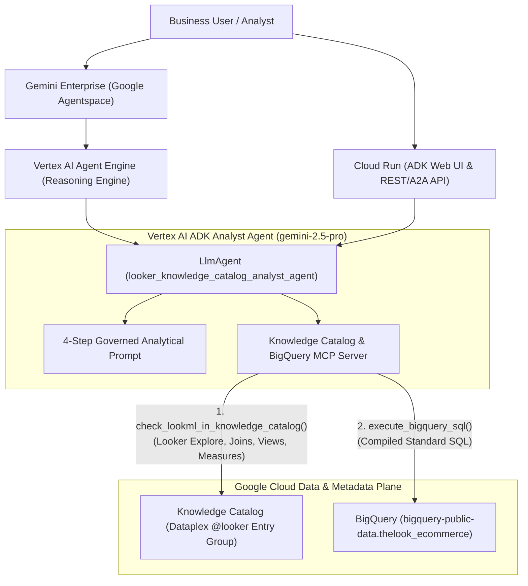

# Vertex AI Looker Analyst Agent: Architecture, Design & Implementation Guide

This guide documents the end-to-end architecture, code implementation, and deployment steps for building an **Enterprise Data Analyst Agent** on **Vertex AI (`google-adk`)** that connects to:
1. **Google Cloud Knowledge Catalog (Dataplex) MCP** — to discover and retrieve certified Looker semantic metadata (Looker Explores, Views, Joins, Dimensions, Measures, SQL formulas, and Fiscal Year rules).
2. **BigQuery MCP Toolbox for Databases** — to compile those LookML definitions into BigQuery Standard SQL and execute them safely.
3. **Google Cloud Run & Gemini Enterprise (Google Agentspace)** — to scale and expose the agent across the organization.

---

## 1. System Architecture



### Key Architectural Principles
- **Zero Hallucinated Metric Logic**: The agent never guesses how business metrics (e.g., *Net Revenue* or *Net AOV*) or fiscal calendars are calculated. Every formula is retrieved from Knowledge Catalog (`@looker` entry group synced from Looker Core).
- **LookML Join Graph Enforcement**: The agent inspects the Looker Explore (`customer_orders`) to determine the exact base table (`order_items`), join types (`LEFT_OUTER`), relationships (`MANY_TO_ONE`), and join keys (`${order_items.user_id} = ${users.id}`).
- **Multi-Environment Authentication**: Works seamlessly across local development (via `gcloud auth print-access-token`), Google Cloud Run, and Vertex AI Agent Engine (via the GCP Metadata Server).

---

## 2. Project Directory Structure

```text
demo-kc-bq/
├── looker_analyst_agent/
│   ├── __init__.py               # Exports `root_agent` for ADK discovery
│   ├── agent.py                  # Vertex AI LlmAgent & resilient auth bridge
│   ├── kc_bq_mcp_server.py       # Knowledge Catalog MCP + BigQuery SQL MCP tools
│   ├── prompt.py                 # 4-stage analytical workflow & governance rules
│   └── requirements.txt          # Agent dependencies for Cloud Run & Agent Engine
├── Dockerfile                    # Production container definition for Cloud Run
├── deploy_cloud_run.sh           # One-command Cloud Run deployment + IAM script
├── deploy_agent_engine.py        # One-command Vertex AI Agent Engine deployment
└── run_demo_query.py             # End-to-end CLI verification runner
```

---

## 3. Core Implementation Details & Code Snippets

### 3.1 Knowledge Catalog & BigQuery MCP Server (`kc_bq_mcp_server.py`)

This module exposes the MCP tools that bridge **Dataplex Knowledge Catalog** (`@looker` entries) and **BigQuery**:

```python
import os
import shutil
import subprocess
import time
from typing import Any, Dict
import requests

try:
    from mcp.server.mcpserver import MCPServer as FastMCP
except ImportError:
    from mcp.server.fastmcp import FastMCP

mcp = FastMCP("KnowledgeCatalog-BigQuery-Looker-Analyst-MCP")

DEFAULT_PROJECT_ID = os.environ.get("GOOGLE_CLOUD_PROJECT", "haengeun-429200")
_TOKEN_CACHE: Dict[str, Any] = {"token": None, "expires_at": 0}


def _get_access_token() -> str:
    """Retrieves a Google Cloud access token across Cloud Run, Agent Engine, or local dev."""
    now = time.time()
    if _TOKEN_CACHE["token"] and now < _TOKEN_CACHE["expires_at"]:
        return _TOKEN_CACHE["token"]

    # 1. Explicit environment variable override
    env_token = os.environ.get("GOOGLE_OAUTH_ACCESS_TOKEN")
    if env_token:
        _TOKEN_CACHE["token"] = env_token.strip()
        _TOKEN_CACHE["expires_at"] = now + 3000
        return _TOKEN_CACHE["token"]

    # 2. Native Cloud Run / Vertex AI Agent Engine Metadata Server (~1ms)
    try:
        meta_resp = requests.get(
            "http://metadata.google.internal/computeMetadata/v1/instance/service-accounts/default/token",
            headers={"Metadata-Flavor": "Google"},
            timeout=2,
        )
        if meta_resp.status_code == 200:
            token_data = meta_resp.json()
            access_token = token_data.get("access_token")
            if access_token:
                _TOKEN_CACHE["token"] = access_token
                _TOKEN_CACHE["expires_at"] = now + min(token_data.get("expires_in", 3000), 3000)
                return _TOKEN_CACHE["token"]
    except Exception:
        pass

    # 3. Local development fallback via gcloud CLI
    if shutil.which("gcloud"):
        res = subprocess.run(
            ["gcloud", "auth", "print-access-token"],
            capture_output=True,
            text=True,
            check=False,
        )
        if res.returncode == 0 and res.stdout.strip():
            _TOKEN_CACHE["token"] = res.stdout.strip()
            _TOKEN_CACHE["expires_at"] = now + 3000
            return _TOKEN_CACHE["token"]

    raise RuntimeError("Unable to obtain Google Cloud access token.")
```

#### Tool 1: `check_lookml_in_knowledge_catalog`
Retrieves the Looker Explore (`customer_orders`), join graph (`joins`), underlying BigQuery tables (`sourceTable`), and exact LookML measure formulas (`annotations.sql`):

```python
@mcp.tool()
def check_lookml_in_knowledge_catalog(
    explore_query: str = "customer_orders",
    project_id: str = DEFAULT_PROJECT_ID,
) -> Dict[str, Any]:
    """Check and retrieve certified LookML metadata (Looker Explore, joins, Views, dimensions,
    and measure SQL definitions) stored in Google Cloud Knowledge Catalog (Dataplex)."""
    # 1. Search Dataplex Knowledge Catalog for the Looker Explore
    search_res = search_knowledge_catalog(explore_query, system="LOOKER", project_id=project_id)
    explore_entry = None
    for item in search_res.get("results", []):
        if item.get("entryType") == "looker-explore":
            explore_entry = item.get("entryName")
            break

    # 2. Fallback to direct @looker entry lookup if search index filters service accounts
    if not explore_entry:
        explore_entry = (
            f"projects/{project_id}/locations/europe-west4/entryGroups/@looker/entries/"
            f"looker.googleapis.com/projects/{project_id}/locations/europe-west4/instances/"
            f"looker-core-haengeun-429200/lookml_projects/haengeun_argolis_demo/models/"
            f"thelook_ecommerce_haengeun_us/explores/{explore_query}"
        )

    explore_meta = get_looker_explore_metadata(explore_entry, project_id)
    # Fetch base view + all joined views and return complete semantic schema...
```

#### Tool 2: `execute_bigquery_sql`
Executes read-only Standard SQL queries compiled from the LookML metadata:

```python
@mcp.tool()
def execute_bigquery_sql(
    sql: str,
    project_id: str = DEFAULT_PROJECT_ID,
) -> Dict[str, Any]:
    """Execute a Standard SQL query in BigQuery and return the results."""
    forbidden = ["DROP ", "TRUNCATE ", "DELETE ", "ALTER ", "UPDATE ", "INSERT "]
    for word in forbidden:
        if word in sql.upper():
            return {"error": f"Disallowed SQL statement containing '{word.strip()}'."}

    url = f"https://bigquery.googleapis.com/bigquery/v2/projects/{project_id}/queries"
    resp = requests.post(
        url,
        headers=_headers(project_id),
        json={"query": sql, "useLegacySql": False, "maxResults": 1000},
        timeout=60,
    )
    data = resp.json()
    schema_fields = [f["name"] for f in data.get("schema", {}).get("fields", [])]
    rows = [dict(zip(schema_fields, [c.get("v") for c in r.get("f", [])])) for r in data.get("rows", [])]
    return {"columns": schema_fields, "rows": rows, "totalRows": int(data.get("totalRows", 0))}
```

---

### 3.2 Agent Prompt & Governance Workflow (`prompt.py`)

> **ADK Template Brace Gotcha**: `google-adk` automatically runs regex session-state variable substitution (`inject_session_state`) on single curly braces `{...}` inside `LlmAgent(instruction=...)`. When referencing LookML syntax like `${TABLE}` in your prompt, always write `$TABLE` (without single curly braces) to avoid `KeyError: "Context variable not found: TABLE"`.

```python
LOOKER_ANALYST_PROMPT = """You are an Enterprise Data Analyst Agent built on Vertex AI.
Your mission is to answer business and analytical questions accurately by combining:
1. Knowledge Catalog MCP (Dataplex) — to discover certified Looker metadata (Looker Explores, Views, Joins, Measures).
2. BigQuery MCP Toolbox for Databases — to execute governed Standard SQL queries against BigQuery.

### MANDATORY 4-STEP ANALYTICAL WORKFLOW

#### Step 1: Semantic Discovery via Knowledge Catalog MCP
- Before writing or running ANY SQL query, call `check_lookml_in_knowledge_catalog` to retrieve the authoritative Looker semantic model from Knowledge Catalog.
- The authoritative corporate LookML project is `haengeun_argolis_demo` (model: `thelook_ecommerce_haengeun_us`, primary explore: `customer_orders`).

#### Step 2: Inspect Looker Explore Joins & View SQL Definitions
- Inspect the Looker Explore's `baseViewName` (`order_items`) and its `joins` array (`sqlOn`, `type`, `relationship`).
- Inspect the Looker Views (`order_items`, `users`, `orders`, `products`) for their `sourceTable` and exact `sql` parameter:
  - `net_revenue` = `SUM(CASE WHEN order_items.status = 'Complete' THEN order_items.sale_price ELSE 0 END)`
  - Fiscal year offset: `fiscal_month_offset: 1` (Fiscal Year starts February 1).

#### Step 3: Compile LookML to BigQuery Standard SQL & Execute
- Translate LookML references (`$TABLE.col` and `$view.field`) into BigQuery Standard SQL using the exact `sourceTable` and `LEFT OUTER JOIN` clauses from the Looker Explore.
- Execute the compiled SQL query using `execute_bigquery_sql`.

#### Step 4: Deliver Governed Answer & Looker Metadata Attribution
- Present a clear answer with markdown tables and a **Looker Semantic & Governance Attribution** table citing the Looker Explore, Views, Joins, and certified LookML measure formulas used.
"""
```

---

### 3.3 Vertex AI Agent Definition (`agent.py`)

```python
import os
from google.adk.agents import LlmAgent
from looker_analyst_agent.prompt import LOOKER_ANALYST_PROMPT
from looker_analyst_agent.kc_bq_mcp_server import (
    check_lookml_in_knowledge_catalog,
    search_knowledge_catalog,
    get_looker_explore_metadata,
    get_looker_view_metadata,
    execute_bigquery_sql,
)

os.environ.setdefault("GOOGLE_GENAI_USE_VERTEXAI", "1")
os.environ.setdefault("GOOGLE_CLOUD_PROJECT", "haengeun-429200")
os.environ.setdefault("GOOGLE_CLOUD_LOCATION", "us-central1")

root_agent = LlmAgent(
    model=os.environ.get("VERTEX_MODEL", "gemini-2.5-pro"),
    name="looker_knowledge_catalog_analyst_agent",
    description=(
        "Enterprise Data Analyst Agent powered by Vertex AI that connects to "
        "Knowledge Catalog (Dataplex) MCP for Looker semantic metadata and BigQuery MCP Toolbox."
    ),
    instruction=LOOKER_ANALYST_PROMPT,
    tools=[
        check_lookml_in_knowledge_catalog,
        search_knowledge_catalog,
        get_looker_explore_metadata,
        get_looker_view_metadata,
        execute_bigquery_sql,
    ],
)
```

---

## 4. Deployment & Scaling Guide

### 4.1 Required Service Account IAM Permissions

Both the **Cloud Run Service Account** (`<PROJECT_NUMBER>-compute@developer.gserviceaccount.com`) and the **Vertex AI Reasoning Engine Service Account** (`service-<PROJECT_NUMBER>@gcp-sa-aiplatform-re.iam.gserviceaccount.com`) require the following IAM roles on the project:

```bash
PROJECT_ID="haengeun-429200"
PROJECT_NUMBER=$(gcloud projects describe "$PROJECT_ID" --format="value(projectNumber)")

for SA in \
  "${PROJECT_NUMBER}-compute@developer.gserviceaccount.com" \
  "service-${PROJECT_NUMBER}@gcp-sa-aiplatform-re.iam.gserviceaccount.com"; do
  for ROLE in \
    "roles/aiplatform.user" \
    "roles/viewer" \
    "roles/dataplex.viewer" \
    "roles/dataplex.catalogViewer" \
    "roles/looker.schemaViewer" \
    "roles/looker.admin" \
    "roles/bigquery.jobUser" \
    "roles/bigquery.dataViewer"; do
    gcloud projects add-iam-policy-binding "$PROJECT_ID" \
      --member="serviceAccount:${SA}" \
      --role="$ROLE" \
      --condition=None
  done
done
```

### 4.2 Deploying to Google Cloud Run (ADK Web UI + REST API + A2A)

Deploy the agent as an autoscaling serverless container on Cloud Run with both the interactive **ADK Web UI** (`--with_ui`) and **Agent2Agent (`A2A`)** protocol (`--a2a`) enabled:

```bash
adk deploy cloud_run \
  --project=haengeun-429200 \
  --region=us-central1 \
  --service_name=looker-analyst-agent \
  --with_ui \
  --a2a \
  --env GOOGLE_GENAI_USE_VERTEXAI=1 \
  --env GOOGLE_CLOUD_PROJECT=haengeun-429200 \
  --env GOOGLE_CLOUD_LOCATION=us-central1 \
  looker_analyst_agent \
  -- --allow-unauthenticated
```
- **Live Cloud Run Service URL**: `https://looker-analyst-agent-2599363625.us-central1.run.app`

### 4.3 Deploying to Vertex AI Agent Engine & Registering in Gemini Enterprise

#### Step 1: Deploy to Vertex AI Agent Engine (`ReasoningEngine`)
```bash
adk deploy agent_engine \
  --project=haengeun-429200 \
  --region=us-central1 \
  --agent_engine_id=4496964624452681728 \
  --display_name="Looker Knowledge Catalog Analyst Agent" \
  --description="Enterprise Data Analyst Agent grounded in Looker semantic metadata from Knowledge Catalog (Dataplex) and BigQuery." \
  looker_analyst_agent
```
- **Provisioned Reasoning Engine Resource Name**:
  `projects/haengeun-429200/locations/us-central1/reasoningEngines/4496964624452681728`

#### Step 2: Link to Gemini Enterprise (Google Agentspace)
In the **Google Cloud Console** ($\to$ **AI Applications / Agentspace** $\to$ **Apps** $\to$ your Gemini Enterprise app $\to$ **Agents** $\to$ **Add Agent** $\to$ **Custom Agent / Vertex AI Agent Engine**):
- **Display Name**: `Looker Knowledge Catalog Analyst Agent`
- **Reasoning Engine Resource Name**:
  `projects/haengeun-429200/locations/us-central1/reasoningEngines/4496964624452681728`
- **Authorization**: Leave blank (*No authorization* — uses the Reasoning Engine's IAM service account).
