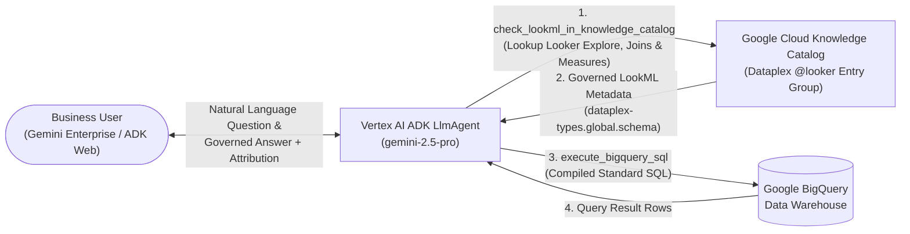

# Vertex AI Looker Knowledge Catalog & BigQuery Analyst Agent

An enterprise Data Analyst Agent built with the **Google Agent Development Kit (`google-adk`)** and **Gemini 2.5 Pro** that answers analytical questions by combining:
1. **Google Cloud Knowledge Catalog (Dataplex)** — for Looker semantic layer metadata (Looker Explores, Looker Views, Join relationships, LookML Measure SQL formulas, and custom governance aspects).
2. **Google BigQuery** — for executing governed Standard SQL queries compiled directly from Looker semantic definitions.

This agent can be run locally via the **ADK Web UI**, deployed as a container to **Google Cloud Run**, or deployed as a managed **Vertex AI Agent Engine** reasoning engine linked directly into **Gemini Enterprise (Google Agentspace)**.

---

## 1. Architecture & Governed Semantic Workflow

Traditional Text-to-SQL agents often hallucinate metric formulas, join conditions, and fiscal calendar rules when querying raw data warehouse tables directly.

To guarantee **100% metric governance**, this agent enforces a two-tier semantic architecture:
1. **Semantic Discovery Layer (Dataplex Knowledge Catalog MCP)**:
   - The agent queries Google Cloud Knowledge Catalog (Dataplex) to discover **Looker Explores** (`dataplex-types.global.looker-explore`) and **Looker Views** (`dataplex-types.global.looker-view`).
   - It inspects the `dataplex-types.global.schema` aspect attached to each Looker View to retrieve the exact LookML `sql` formulas for dimensions and measures, join relationships (`sql_on`, `MANY_TO_ONE`), and fiscal year offsets (`fiscal_month_offset: 1`).
2. **Execution Layer (BigQuery Standard SQL)**:
   - Using the governed LookML expressions retrieved from Knowledge Catalog, the agent compiles and executes read-only BigQuery Standard SQL queries and attributes the answer back to its Looker semantic source.



---

## 2. Repository Structure

```text
.
├── looker_analyst_agent/            # Core Vertex AI ADK Agent Package
│   ├── __init__.py                  # Exports root_agent for ADK CLI & Agent Engine
│   ├── agent.py                     # LlmAgent definition, tools & resilient auth bridge
│   ├── kc_bq_mcp_server.py          # MCP Tools for Knowledge Catalog (Dataplex) & BigQuery
│   ├── prompt.py                    # 4-stage governed analytical system prompt
│   └── requirements.txt             # Python dependencies for agent container
├── Dockerfile                       # Container definition for Cloud Run deployment
├── deploy_cloud_run.sh              # Automated Cloud Run deployment script (with ADK Web UI)
├── deploy_agent_engine.sh           # Automated Vertex AI Agent Engine deployment script (bash)
├── deploy_agent_engine.py           # Programmatic Vertex AI Agent Engine deployment script
├── run_demo_query.py                # CLI runner for testing governed queries locally
└── requirements.txt                 # Root development dependencies
```

---

## 3. Minimum Requirements vs. Optional Custom Enrichments

When setting up this agent in your own Google Cloud environment, distinguish between **out-of-the-box Looker metadata** (minimum requirement) and **custom governance aspects** (optional enrichments).

### A. Minimum Requirements (Standard Out-of-the-Box Looker Connector)
To run this agent in your own Google Cloud project, you only need:
1. **A Google Cloud Project** with BigQuery and Dataplex APIs enabled.
2. **Looker Metadata in Dataplex Knowledge Catalog**:
   - When you connect a Looker instance to Dataplex Knowledge Catalog, Dataplex automatically creates a native `@looker` entry group (`projects/YOUR-GCP-PROJECT/locations/<location>/entryGroups/@looker`) and syncs three standard system aspect types:
     - **`dataplex-types.global.looker-explore`**: Contains the Explore's `baseViewName`, `joins` array (`sqlOn`, `relationship`, `type`), and pre-built LookML queries.
     - **`dataplex-types.global.looker-view`**: Contains the underlying BigQuery `sourceTable` (`sql_table_name`) and LookML file path.
     - **`dataplex-types.global.schema`**: Contains every LookML dimension, dimension group, and measure along with its exact LookML `sql` expression (`annotations.sql`).

**No custom aspects are required** for the agent to discover Explores, resolve joins, compile LookML measures to SQL, and execute BigQuery queries.

> **Zero-Setup Demo Mode**: If your Dataplex Knowledge Catalog does not yet have a Looker instance connected, `check_lookml_in_knowledge_catalog` includes a built-in reference snapshot of the certified `customer_orders` LookML semantic model over `bigquery-public-data.thelook_ecommerce` so you can immediately test the agent out-of-the-box.

### B. Optional Custom Enrichments (Custom Dataplex Governance Aspect Types)
To add enterprise governance controls (such as certification tiers, data ownership, or PII tags), you can optionally create **Custom Dataplex Aspect Types** in your project and attach them to Looker Explores or Views.

For example, in our reference deployment, we created and attached custom governance aspects such as:
- **`data-certification-governance`**:
  - `Certified`: `True` (Boolean)
  - `Certification Tier`: `Gold` (`Gold`, `Silver`, `Bronze`)
  - `Environment`: `PRODUCTION` (`PRODUCTION`, `STAGING`, `DEVELOPMENT`)
  - `Data Owner`: `Finance & Revenue Operations`
- **`pii-security-compliance`**: Flags fields containing sensitive customer PII.
- **`business-glossary-domain`**: Maps technical Looker views to corporate business domains.

#### How to Create a Custom Governance Aspect Type in Dataplex (Optional)
1. Find your GCP Project ID:
   ```bash
   export GOOGLE_CLOUD_PROJECT=$(gcloud config get-value project)
   ```
2. Define an aspect template (`aspect_template.json`):
   ```json
   {
     "name": "data_certification_governance",
     "type": "record",
     "recordFields": [
       {
         "name": "certified",
         "type": "bool",
         "index": 1,
         "annotations": { "description": "Whether this Looker asset is certified for executive reporting." }
       },
       {
         "name": "certification_tier",
         "type": "enum",
         "index": 2,
         "enumValues": [
           { "name": "Gold", "index": 1 },
           { "name": "Silver", "index": 2 },
           { "name": "Bronze", "index": 3 }
         ]
       },
       {
         "name": "environment",
         "type": "string",
         "index": 3
       }
     ]
   }
   ```
3. Register the custom Aspect Type in Dataplex:
   ```bash
   gcloud dataplex aspect-types create data-certification-governance \
     --project="$GOOGLE_CLOUD_PROJECT" \
     --location=us-central1 \
     --description="Enterprise Data Certification & Governance Tier" \
     --metadata-template-file-name=aspect_template.json
   ```

---

## 4. Key Engineering Patterns

### 4.1 Cloud Run & Agent Engine Container Authentication (`_get_access_token()`)
Inside Cloud Run and Vertex AI Agent Engine containers, the `gcloud` CLI binary is not installed (`[Errno 2] No such file or directory: 'gcloud'`).

To work seamlessly across Cloud Run, Vertex AI Agent Engine, and local development, [`looker_analyst_agent/kc_bq_mcp_server.py`](looker_analyst_agent/kc_bq_mcp_server.py) implements a multi-tier token resolution strategy that prioritizes the **GCP Compute Metadata Server**:

```python
def _get_access_token() -> str:
    """Gets a valid Google Cloud access token for Cloud Run/Agent Engine (Metadata Server) or local dev (gcloud CLI)."""
    # 1. Native Cloud Run / Agent Engine Metadata Server (instant inside GCP containers)
    try:
        meta_resp = requests.get(
            "http://metadata.google.internal/computeMetadata/v1/instance/service-accounts/default/token",
            headers={"Metadata-Flavor": "Google"},
            timeout=2,
        )
        if meta_resp.status_code == 200:
            token_data = meta_resp.json()
            access_token = token_data.get("access_token")
            if access_token:
                return access_token
    except Exception:
        pass

    # 2. Local development fallback via gcloud CLI (only if installed)
    if shutil.which("gcloud"):
        res = subprocess.run(
            ["gcloud", "auth", "print-access-token"],
            capture_output=True,
            text=True,
            check=False,
        )
        if res.returncode == 0 and res.stdout.strip():
            return res.stdout.strip()
```

### 4.2 Direct `@looker` Entry Group Lookup
When an agent runs under a service account (such as Vertex AI Agent Engine's `service-<PROJECT_NUMBER>@gcp-sa-aiplatform-re.iam.gserviceaccount.com`), Dataplex's global `searchEntries` API can filter out `@looker` entries unless the service account has explicit Looker Schema Viewer permissions (`roles/looker.schemaViewer`).

To guarantee reliability, `check_lookml_in_knowledge_catalog` implements a direct lookup against the known `@looker` entry path (`entries.get` with `view=FULL`) when `searchEntries` returns 0 results:

```python
    if not explore_entry:
        explore_entry = (
            f"projects/{project_id}/locations/{DEFAULT_LOCATION}/entryGroups/@looker/entries/"
            f"looker/explores/{LOOKER_MODEL_NAME}.{explore_query}"
        )
```

---

## 5. Step-by-Step Setup & Deployment

### Step 1: Find Your GCP Project ID & Configure IAM Permissions
Run the following commands to inspect your active GCP Project ID, Project Number, and grant required IAM permissions:

```bash
# 1. Print your active GCP Project ID
gcloud config get-value project

# 2. Export your GCP Project ID and Region
export GOOGLE_CLOUD_PROJECT=$(gcloud config get-value project)
export GOOGLE_CLOUD_LOCATION="us-central1"

# 3. Get your Project Number (used for Service Account IAM bindings)
export PROJECT_NUMBER=$(gcloud projects describe "$GOOGLE_CLOUD_PROJECT" --format="value(projectNumber)")

# 4. Grant required IAM roles to Cloud Run / Agent Engine Service Accounts
for SA in \
  "${PROJECT_NUMBER}-compute@developer.gserviceaccount.com" \
  "service-${PROJECT_NUMBER}@gcp-sa-aiplatform-re.iam.gserviceaccount.com"; do
  for ROLE in \
    "roles/aiplatform.user" \
    "roles/dataplex.viewer" \
    "roles/dataplex.catalogViewer" \
    "roles/looker.schemaViewer" \
    "roles/bigquery.jobUser" \
    "roles/bigquery.dataViewer"; do
    gcloud projects add-iam-policy-binding "$GOOGLE_CLOUD_PROJECT" \
      --member="serviceAccount:${SA}" \
      --role="$ROLE" \
      --condition=None || true
  done
done
```

### Step 2: Run Locally with ADK Web UI

```bash
# 1. Create and activate a virtual environment
python3 -m venv .venv
source .venv/bin/activate
pip install -r requirements.txt

# 2. Authenticate locally
gcloud auth login
gcloud auth application-default login

# 3. Test via CLI runner
python3 run_demo_query.py

# 4. Launch the interactive ADK Web UI
adk web --port 8000
```
Open `http://localhost:8000` in your browser and select `looker_analyst_agent`.

### Step 3: Deploy to Google Cloud Run (with Web UI & A2A Protocol)
Run the included [`deploy_cloud_run.sh`](deploy_cloud_run.sh) script:

```bash
export GOOGLE_CLOUD_PROJECT="YOUR-GCP-PROJECT"
export GOOGLE_CLOUD_REGION="us-central1"

./deploy_cloud_run.sh
```

### Step 4: Deploy to Vertex AI Agent Engine & Gemini Enterprise (Agentspace)
Run [`deploy_agent_engine.sh`](deploy_agent_engine.sh) to deploy the agent as a managed Vertex AI Reasoning Engine:

```bash
export GOOGLE_CLOUD_PROJECT="YOUR-GCP-PROJECT"
export GOOGLE_CLOUD_REGION="us-central1"

./deploy_agent_engine.sh
```

After deployment completes, copy the Reasoning Engine resource path:
```text
projects/YOUR-GCP-PROJECT/locations/us-central1/reasoningEngines/YOUR_REASONING_ENGINE_ID
```

#### Connecting to Gemini Enterprise (Google Agentspace)
1. Open **Google Cloud Console -> Gemini Enterprise (Agentspace) -> Agents**.
2. Click **Create Agent -> Custom Agent (Vertex AI Agent Engine)**.
3. Paste your Reasoning Engine resource path (`projects/YOUR-GCP-PROJECT/locations/us-central1/reasoningEngines/YOUR_REASONING_ENGINE_ID`).
4. Skip OAuth configuration (**Option A: Service Account Auth**) — the agent automatically authenticates using its Vertex AI Reasoning Engine Service Account via the GCP Metadata Server.
