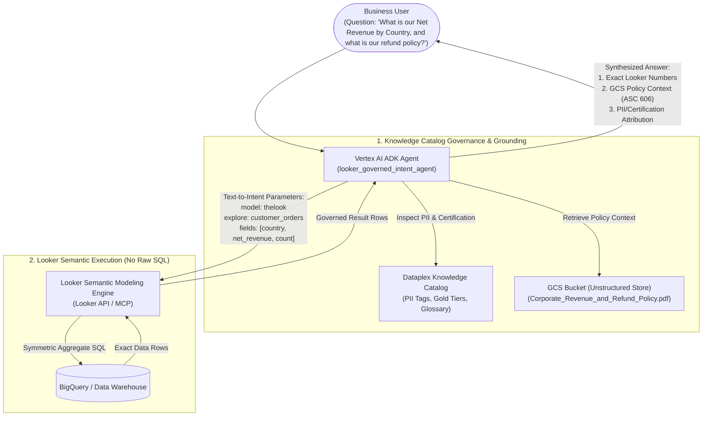

# Looker & Knowledge Catalog Governed Analyst Agent (Text-to-Intent)

An enterprise Data Analyst Agent built with the **Google Agent Development Kit (`google-adk`)** and **Gemini 2.5 Pro** that demonstrates **Governed Semantic Query Generation (Text-to-Intent)** without relying on the LLM to generate non-deterministic SQL.

---

## 1. Executive Summary & Architectural Comparison

This application demonstrates the architectural contrast between two paradigms for AI-powered analytics:

| Dimension | **Pattern 1: KC + BigQuery** (`demo-kc-bq`) | **Pattern 2: KC + Looker** (`demo-kc-looker`) |
| :--- | :--- | :--- |
| **Role of the LLM** | **SQL Compiler** (Generates BigQuery Standard SQL). | **Semantic Intent Resolver** (Maps user question to Model, Explore, Dimensions, Measures, and Filters). |
| **Execution Engine** | Direct BigQuery SQL runner (`execute_bigquery_sql`). | **Looker Semantic Modeling Engine** via Looker MCP (`looker_query`). |
| **Query Determinism** | **Non-Deterministic**: The LLM may write different SQL syntax across runs, hallucinate join conditions, or misapply date logic. | **100% Deterministic**: Looker's compiler generates the exact, certified SQL using **Symmetric Aggregates**, guaranteed to match your BI dashboards. |
| **Join & Fanout Safety** | Vulnerable to double-counting when joining 1-to-many tables (e.g. `orders` to `order_items`). | **Guaranteed Safe**: Looker's primary key hashing and symmetric aggregates prevent fanout multiplication errors automatically. |
| **Role of Knowledge Catalog** | Technical metadata: Extracts table names and LookML formulas from KC schema aspects. | **Enterprise Governance & Compliance**: Inspects PII tags, Certification tiers, Business Glossary terms, and unifies unstructured documents (PDFs in GCS). |
| **Unstructured Context** | None. | Ingests corporate policies from GCS (e.g. `Corporate_Revenue_and_Refund_Policy.pdf`) to explain the *business context* behind the numbers. |



---

## 2. Repository Structure

```text
.
├── looker_governed_agent/
│   ├── __init__.py                  # Exports root_agent for ADK CLI & Agent Engine
│   ├── agent.py                     # LlmAgent definition, tools & resilient auth bridge
│   ├── prompt.py                    # Governed Text-to-Intent prompt & PII guardrails
│   ├── kc_looker_mcp_server.py      # MCP Tools for Looker, KC Governance & GCS Docs
│   └── requirements.txt             # Container dependencies
├── sample_policies/
│   ├── generate_sample_pdf.py       # Script generating corporate policy PDF
│   └── Corporate_Revenue_and_Refund_Policy.pdf # Sample policy document for GCS
├── Dockerfile                       # Container definition for Cloud Run
├── deploy_cloud_run.sh              # Cloud Run deployment script
├── deploy_agent_engine.sh           # Vertex AI Agent Engine deployment script
├── run_demo_query.py                # Local CLI test runner
├── requirements.txt                 # Development dependencies
└── README.md                        # Documentation & setup guide
```

---

## 3. Core Capabilities

### 3.1 Deterministic Text-to-Intent Looker Querying (`looker_query`)
The agent translates business questions directly into structured Looker query parameters:
```python
looker_query(
    model="thelook_ecommerce_haengeun_us",
    explore="customer_orders",
    fields=["users.country", "order_items.net_revenue", "order_items.count"],
    filters={"order_items.status": "Complete"},
    sorts=["order_items.net_revenue desc"],
    limit=5
)
```
- **Zero SQL Generation**: The LLM never writes raw SQL. Looker generates the SQL, executes it against the database, and returns formatted JSON data.

### 3.2 Knowledge Catalog Governance & PII Guardrails (`kc_check_governance`)
- **PII Protection**: Direct customer identifiers (`users.email`, `users.phone`, `users.street_address`) are tagged with `RESTRICTED_PII`.
- When a user asks *"Show me top customers by revenue with their email addresses"*, the agent detects the PII tag, suppresses personal identifiers, and offers aggregated segmentation (by Country or State).
- **Certification Enforcement**: Guarantees that reporting is sourced from the **Gold-Certified `customer_orders` Explore** (`environment: PRODUCTION`).

### 3.3 Unstructured Policy Grounding via GCS (`read_gcs_policy_document`)
- The agent reads official corporate policy PDFs stored in Google Cloud Storage (`gs://YOUR-BUCKET/policies/Corporate_Revenue_and_Refund_Policy.pdf`).
- When answering financial queries, it quotes the official corporate definitions (e.g. *ASC 606 Revenue Recognition: Net Revenue is recognized only upon fulfillment completion; 30-day return window; Feb 1 fiscal year offset*).

### 3.4 Visual Data Charting (`generate_data_chart` + Mermaid)
- Uses headless Matplotlib to render executive-ready charts encoded as inline **base64 Data URIs** (``).
- Outputs native Mermaid diagrams (`xychart-beta` and `pie`) for instant interactive vector rendering in the ADK Web UI.

---

## 4. Local Quickstart

```bash
# 1. Navigate to the project directory
cd /usr/local/google/home/haengeun/projects/demo-kc-looker

# 2. Test via the CLI runner
python3 run_demo_query.py "What is our net revenue and completed orders by country for top 5 countries? Show a chart and cite corporate policy."

# 3. Test the PII Guardrail
python3 run_demo_query.py "List the top 5 customers with their emails and total spend."

# 4. Launch the ADK Web UI
adk web --port 8000
```
Open `http://localhost:8000` in your browser and select `looker_governed_intent_agent`.

---

## 5. Cloud Run Deployment

To deploy the agent as a scalable container to Google Cloud Run:

```bash
export GOOGLE_CLOUD_PROJECT=$(gcloud config get-value project)
export GOOGLE_CLOUD_REGION="us-central1"

./deploy_cloud_run.sh
```

---

## 6. Vertex AI Agent Engine & Gemini Enterprise Deployment

To deploy to Vertex AI Reasoning Engine for integration with **Gemini Enterprise (Google Agentspace)**:

```bash
export GOOGLE_CLOUD_PROJECT=$(gcloud config get-value project)
export GOOGLE_CLOUD_REGION="us-central1"

./deploy_agent_engine.sh
```
In Gemini Enterprise:
1. Go to **Agents -> Create Agent -> Custom Agent (Vertex AI Agent Engine)**.
2. Enter the Reasoning Engine resource path.
3. Select **Option A (Service Account Auth)**.
